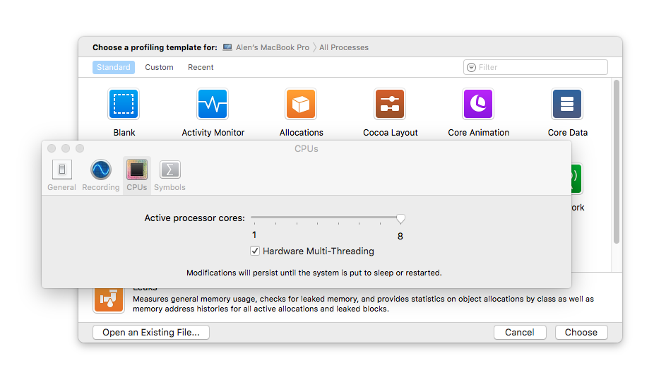

Disable Intel® Hyper-Threading Technology
===================

Hyper-threading is Intel's proprietary simultaneous multithreading (SMT) implementation used to improve parallelization 
of computations (doing multiple tasks at once) performed on x86 microprocessors. 
  
For each processor core that is physically present, the operating system addresses two virtual (logical) cores and 
shares the workload between them when possible. The main function of hyper-threading is to increase the number of 
independent instructions in the pipeline; it takes advantage of superscalar architecture, in which multiple 
operate on separate data in parallel. With HTT, one physical core appears as two processors to the operating system, 
allowing concurrent scheduling of two processes per core. In addition, two or more processes can use the same 
resources: if resources for one process are not available, then another process can continue if its resources are 
available.
 
In addition to requiring simultaneous multithreading (SMT) support in the operating system, hyper-threading can be 
properly utilized only with an operating system specifically optimized for it.

BIOS
----

The only effective way to disable HyperThreading is to use the BIOS.


> Intel® 64 and IA-32 Architectures Software Developer’s Manual <br />
> https://software.intel.com/sites/default/files/managed/39/c5/325462-sdm-vol-1-2abcd-3abcd.pdf
>
> When a processor supporting Intel Hyper-Threading Technology support is initialized, each logical processor is
> assigned a local APIC ID (see Table 10-1). The local APIC ID serves as an ID for the logical processor and is stored
> in the logical processor’s APIC ID register. If two or more processors supporting Intel Hyper-Threading Technology
> are present in a dual processor (DP) or MP system, each logical processor on the system bus is assigned a unique
> local APIC ID (see Section 8.9.3, “Hierarchical ID of Logical Processors in an MP System”).
> Software communicates with local processors using the APIC’s interprocessor interrupt (IPI) messaging facility.
> Setup and programming for APICs is identical in processors that support and do not support Intel Hyper-Threading
> Technology. See Chapter 10, “Advanced Programmable Interrupt Controller (APIC),” for a detailed discussion. 

There are few workarounds possible.

Linux
-----

Instead of disabling HyperThreading, the second best option is to shut-down virtual cores. The proper way would be to
initialize all the logical processors, have them identify themselves, and then optionally take themselves off-line.

> Intel® 64 and IA-32 Architectures Software Developer’s Manual <br />
> https://software.intel.com/sites/default/files/managed/39/c5/325462-sdm-vol-1-2abcd-3abcd.pdf
>
> Read 32-bit APIC ID from CPUID leaf 0BH (If the processor supports CPUID leaf 0BH) — A unique APIC ID
> is assigned to a logical processor during power up. This APIC ID is reported by CPUID.0BH:EDX(31:0) as a 32-
> bit value. Use the 32-bit APIC ID and CPUID leaf 0BH to determine the topological relationship between logical
> processors if the processor supports CPUID leaf 0BH.

This means that before we shut-down the cores, we need to determine the sibling cores, and then take them off-line. To
determine the sibling cores, one can use the [i7z](https://github.com/ajaiantilal/i7z) tool. Then we can shut-down the
cores running:

```sh
# echo 0 > /sys/devices/system/cpu/cpu4/online
# echo 0 > /sys/devices/system/cpu/cpu5/online
# echo 0 > /sys/devices/system/cpu/cpu6/online
# echo 0 > /sys/devices/system/cpu/cpu7/online
```

Windows
--------


Mac OS X
--------

1. Open `Instruments` app.
2. Navigate to `Preferences` and select the `CPUs` tab.
3. Deselect `Hardware Multi-Threading`.



Note that the change is not persistent, and you will have to do it again after restart.
