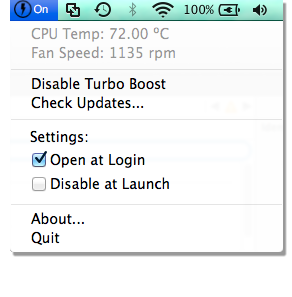

Disable Intel® Turbo Boost Technology
===================

Intel Turbo Boost is a technology implemented by Intel in certain versions of its processors that enables the processor
to run above its base operating frequency via dynamic control of the processor's clock rate. Processor generations 
supporting this feature are based on the Nehalem (Turbo Boost 1.0), Sandy Bridge (Turbo Boost 2.0), Ivy Bridge, 
Haswell, Broadwell, Skylake and Broadwell-E (Intel Turbo Boost Max 3.0) microarchitectures, while the examples of 
Turbo-Boost-enabled processors are the Core i5 and Core i7 series.

Turbo Boost is activated when the operating system requests the highest performance state of the processor. Processor 
performance states are defined by the Advanced Configuration and Power Interface (ACPI) specification, an open standard
supported by all major operating systems; no additional software or drivers are required to support the technology.
The design concept behind Turbo Boost is commonly referred to as "dynamic overclocking".

BIOS
-----

Intel® Turbo Boost Technology is typically enabled by default. You can only disable and enable the technology through a
switch in the BIOS. No other user controllable settings are available. Once enabled, Intel® Turbo Boost Technology works
automatically under operating system control.

When access to BIOS is not available, few workarounds are possible to disable TurboBoost. 

Linux
-----

Linux does not provide interface to disable Turbo Boost. One alternative, that works, is disabling Turbo Boost by 
writing into MSR registers. Assuming 4 cores, the following should work:
 
```commandline
wrmsr -p0 0x1a0 0x4000850089
wrmsr -p1 0x1a0 0x4000850089
wrmsr -p2 0x1a0 0x4000850089
wrmsr -p3 0x1a0 0x4000850089
```

This method has been criticized, stating that the OS can circumvent the MSR value, using opportunistic strategy:

1. https://software.intel.com/en-us/forums/software-tuning-performance-optimization-platform-monitoring/topic/392792
2. https://software.intel.com/en-us/forums/software-tuning-performance-optimization-platform-monitoring/topic/385319

But so far in our tests, we have observed that Linux conforms to the MSR value.

An alternative method would be to use `cpupower`, as explained in the [ArchLinux Wiki][cpupower], as well as the the 
[intel_pstate][pstate] driver. Unfortunately, we can not confirm deterministic behavior across different kernel 
versions with this method.

[cpupower]: https://wiki.archlinux.org/index.php/CPU_frequency_scaling
[pstate]: https://www.kernel.org/doc/Documentation/cpu-freq/intel-pstate.txt

Mac OS X
--------

Disabling Turbo Boost in OS X can be done easily with the [Turbo Boost Switcher for OS X][turboswitcher]. Note that the
change is not persistent after restart. <br />



Turbo Boost Switcher for OS X internally writes to the MSR registers of the Intel CPU to disable Turbo Boost. While this
methodology has been widely criticized, we have not observed any problems so far. 

1. https://software.intel.com/en-us/forums/software-tuning-performance-optimization-platform-monitoring/topic/392792
2. https://software.intel.com/en-us/forums/software-tuning-performance-optimization-platform-monitoring/topic/385319

[turboswitcher]: http://www.rugarciap.com/turbo-boost-switcher-for-os-x/

Windows
-------
